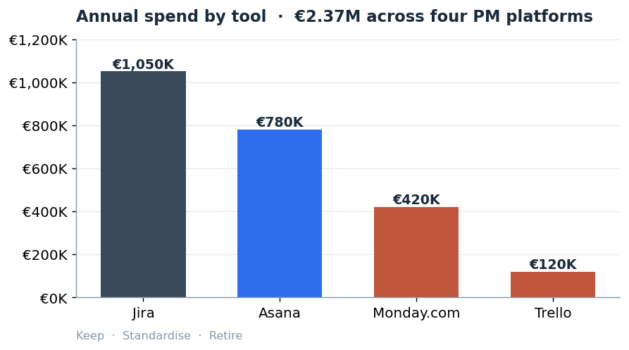
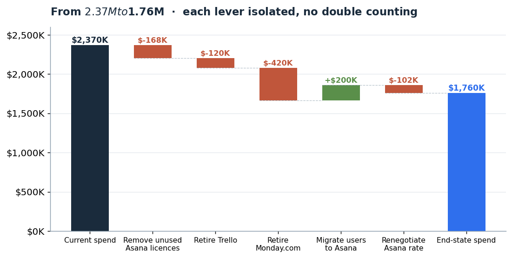
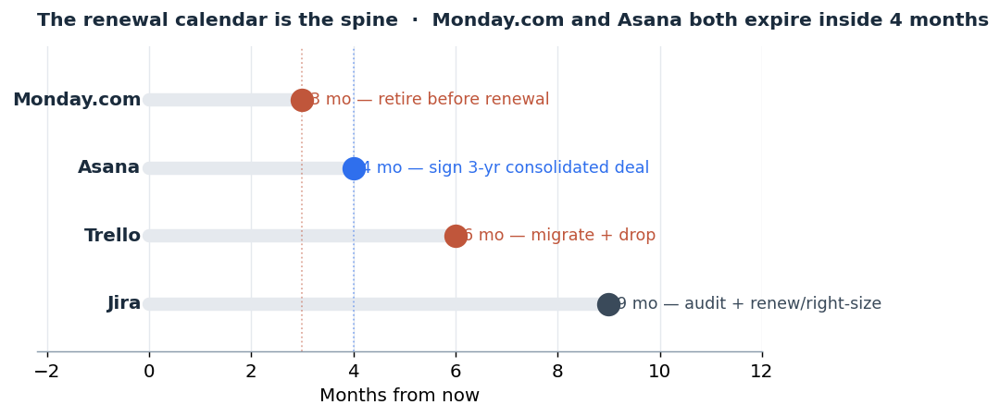

# SaaS Vendor Consolidation: Meridian Mobility

I built this to get sharper at technology-category procurement, specifically the SaaS consolidation and renewal-negotiation problems that keep coming up in fast-growing companies. Most procurement portfolios I have seen stop at "here is where the money is." I wanted one that carries on into the part that is actually hard: how you go and get the saving out of the vendor.

So this is a full case, worked end to end. The brief, the analysis, a supplier scorecard, the negotiation strategy, and the recommendation I would put in front of a VP of Procurement.

Meridian Mobility is a fictional multi-mobility company, the kind that runs taxi, private-hire and micromobility inside one app across Europe. Every current-state number comes from the case brief. The negotiated rates and the savings estimates are my own judgement. I have written the reasoning down rather than just asserting the numbers, because a saving you cannot explain is a saving Finance will not sign off.

**Start here:** [`RECOMMENDATION.pdf`](RECOMMENDATION.pdf) is the deck. Answer on the first slide, calculations in the appendix. It opens in the browser.

---

## Why this one is different from my other two

I already have a [spend-analysis repo](https://github.com/ShrutiSMorab/procurement-spend-analytics) and an [IT procurement case](https://github.com/ShrutiSMorab/it-procurement-case-study). Both stop at the recommendation. This one keeps going, into the negotiation.

The centre of the repo is [`NEGOTIATION-STRATEGY.md`](NEGOTIATION-STRATEGY.md): the BATNA, the opening and target and walk-away, the concession ladder, and the renewal calendar that decides the whole sequence. The spend numbers are just the setup for it. I built it this way on purpose, because "advanced negotiation" is the line every procurement job description leans on and the one thing that is genuinely hard to show on paper.

## The five parts

**1. The brief.** [`CASE-BRIEF.md`](CASE-BRIEF.md) ([Word](CASE-BRIEF.docx)) is the case as a manager would hand it over: the company, the mess, the constraints, what they want back.

**2. The analysis.** [`saas_analysis.xlsx`](saas_analysis.xlsx) is the working model. Live formulas across current state, end state, the savings bridge and a scenario range. Change a blue cell and it all recalculates. [`analysis.py`](analysis.py) builds the charts. [`ANALYSIS-NOTES.md`](ANALYSIS-NOTES.md) is the full reasoning, including a double count I had to fix in the brief and the numbers I trust least.

**3. The scorecard.** [`SUPPLIER-SCORECARD.md`](SUPPLIER-SCORECARD.md) scores the four vendors on weighted criteria. The interesting bit is that the top two tie, and why that tie is the recommendation rather than a problem.

**4. The negotiation.** [`NEGOTIATION-STRATEGY.md`](NEGOTIATION-STRATEGY.md). The part of the job a spreadsheet cannot show.

**5. The recommendation.** [`RECOMMENDATION.pdf`](RECOMMENDATION.pdf) ([PowerPoint](RECOMMENDATION.pptx) with speaker notes). Eight slides, answer first.

---

## The problem in short

$2.37M a year on four project-management tools that do broadly the same job. Around 180 people hold licences on two or more of them. Utilisation runs as low as 48% on one tool. Every contract was signed separately, so Meridian has never once negotiated as a single enterprise buyer.



## What I concluded

Keep Jira for Engineering, who will not and should not move. Standardise everyone else onto Asana. Retire Monday.com and Trello and rehome their users. Fix the rate and the terms at the Asana renewal, and put a flex-down clause in the contract so the idle-licence problem cannot rebuild.

That takes annual spend from $2.37M to $1.76M, a saving of about $610K, or 26%. I report it as a range, $540K to $750K, because the number rests on a rate I have modelled rather than quoted.



The whole plan runs off the renewal calendar. Monday.com expires one month before Asana, which means I can retire a vendor first and walk into the Asana renewal having already shown I will cut a tool that is not earning its keep.



## The part that took me longest

The savings maths, and not because it is complicated. The brief hands you three savings buckets and invites you to add them up: unused licences, duplicates, enterprise pricing. When I actually modelled it I realised those buckets overlap. If you retire Monday.com, its unused seats and its duplicate seats are already gone inside the retirement number, so counting them again inflates the total. I threw out the add-the-buckets approach and modelled one end state instead, then took the difference. That is why the savings bridge isolates every lever, and why the migrated seats are priced at the negotiated rate so the discount is never counted twice. It is a small thing that changes the answer, and it is the bit I would want a hiring manager to ask me about.

## What I would want before signing anything

The base case assumes no saving from Jira, because the brief gives no Jira usage data and Jira is 44% of the spend. That blind spot, plus the soft estimate of how many users already hold Asana, are the two things I would nail down first in a real role. Both are written up in the analysis notes rather than smoothed over. The negotiated Asana rate is modelled, not quoted, and the negotiation file says so plainly.

## Reproduce the charts and model

```
pip install matplotlib pandas openpyxl
python analysis.py
python build_xlsx.py
```

---

Shruti Morab. [LinkedIn](https://linkedin.com/in/shruti-morab) · [GitHub](https://github.com/ShrutiSMorab)
